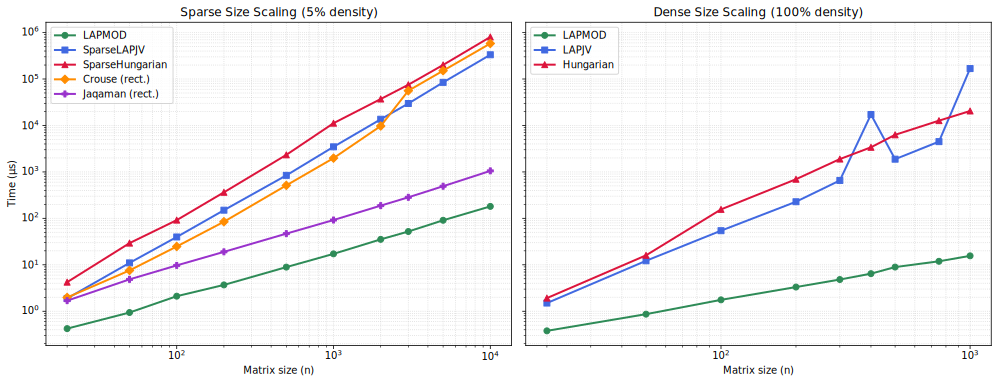

# Weighted Assignment Benchmark

[](https://github.com/LucaCappelletti94/weighted-matching-benchmark/actions/workflows/ci.yml)
[](https://github.com/LucaCappelletti94/weighted-matching-benchmark/blob/main/LICENSE)

## Abstract

We benchmark seven weighted bipartite matching algorithms from the [`geometric-traits`](https://github.com/earth-metabolome-initiative/geometric-traits) crate across three distinct problems: the **linear assignment problem** (LAP) on square matrices, the **rectangular assignment problem** (partial matching on rectangular matrices), and the **tracking assignment problem** (detection linking with birth/death costs). Five algorithms solve LAP (LAPJV, Hungarian, LAPMOD, SparseLAPJV, SparseHungarian), Crouse solves rectangular assignment, and Jaqaman solves tracking assignment. We vary matrix size (20 to 10,000), density (1% to 100%), cost distribution (uniform, diagonal-dominant, block-structured, near-degenerate), and matrix shape (square, wide, tall, extreme aspect ratios up to 1:50).

**Square assignment (LAP):** LAPMOD is the fastest algorithm at every tested size and density, including 100% dense matrices up to n=1,000 where it is **1,314x faster** than Hungarian (at 100% density). At n=10,000 with 5% density LAPMOD takes only 181 us. On dense matrices, At larger sizes (n >= 100), LAPJV is 2.8 to 3.3x faster than Hungarian outside worst case, but hits O(n^3) worst-case behavior at n=400 and n=1,000 where it becomes 5-8x slower than Hungarian (up to 8.2x at n=1,000). Cost distribution does not affect performance.

**Rectangular matrices:** Crouse solves the rectangular assignment problem (partial matching) by compactifying into a dense subproblem over unique rows/cols, solved by LAPJV; it scales with min(rows, cols), confirmed at aspect ratios up to 1:50. Jaqaman solves a different problem (tracking assignment with birth/death costs) by expanding to a (L+R) x (L+R) sparse system solved by LAPMOD; it scales with L+R.

## Visual Summary

<p align="center">
  
</p>

**Left:** Sparse algorithms on **square** matrices at 5% density. LAPMOD (green) scales nearly linearly; Jaqaman (purple, tracking assignment) tracks close behind because of its LAPMOD-based expansion. SparseLAPJV (blue), Crouse (orange, rectangular assignment), and SparseHungarian (red) scale superlinearly. LAPMOD, SparseLAPJV, and SparseHungarian solve LAP (perfect matching); Crouse and Jaqaman solve different problems on rectangular matrices (see Suite 5). **Right:** At 100% density, LAPMOD still dominates. At larger sizes, LAPJV is 2.8-3.3x faster than Hungarian outside worst case, but hits O(n^3) worst case at n=400 and n=1,000 (visible as spikes).

## Algorithms Overview

The algorithms below solve three different problems. Comparing their runtimes is not meaningful; we benchmark them separately (Suites 1-4 for LAP, Suite 5 for rectangular/tracking) and together on square inputs for reference (Suites 1 and 6).

- **Square assignment (LAP):** Given an n x n cost matrix, find a one-to-one matching that assigns every row to exactly one column.
- **Rectangular assignment (Crouse):** Given an L x R matrix (L != R allowed), find a partial matching where some rows and columns may be left unassigned.
- **Tracking assignment (Jaqaman):** Given an L x R cost matrix with birth/death costs, find an assignment where every entity is either matched or assigned to a birth/death event.

### Square Assignment Solvers (LAP)

| Algorithm | Input | Time Complexity | Memory | Method |
|:--|:--|:--|:--|:--|
| LAPJV \[1\] | Dense | O(n^3) worst, sub-cubic in practice | O(n) + input | `.lapjv(max_cost)` |
| Hungarian \[2\] | Dense | O(n^3) | O(n) + input | `.hungarian(max_cost)` |
| LAPMOD \[3\] | Sparse | O(n^3) worst, sub-cubic in practice | O(\|E\| + n) | `.lapmod(max_cost)` |
| SparseLAPJV | Sparse | LAPJV + implicit padding | O(\|E\| + n) | `.sparse_lapjv(padding, max_cost)` |
| SparseHungarian | Sparse | Hungarian + implicit padding | O(\|E\| + n) | `.sparse_hungarian(padding, max_cost)` |

### Rectangular Matrix Solvers

| Algorithm | Problem | Input | Time Complexity | Memory | Method |
|:--|:--|:--|:--|:--|:--|
| Crouse \[4\] | Rectangular assignment | Sparse | O(n^3) worst (on compactified subproblem) | O(n_r' x n_c') | `.crouse(non_edge_cost, max_cost)` |
| Jaqaman \[5\] | Tracking assignment | Sparse | O((L+R)^3) worst (LAPMOD on expanded system) | O(\|E\| + L + R) | `.jaqaman(non_edge_cost, max_cost)` |

n_r' and n_c' are the number of unique rows and columns that have at least one edge.

**LAPJV** (Jonker-Volgenant \[1\]) solves the dense linear assignment problem using column reduction, augmentation, and augmenting row reduction. O(n^3) worst case, but sub-cubic in practice on most inputs. The algorithm itself allocates O(n) working memory; the O(n^2) input matrix is caller-owned.

**Hungarian** (Kuhn-Munkres \[2\]) is the classical O(n^3) algorithm based on dual variables and augmenting paths. Typically slower than LAPJV on dense matrices, but faster when LAPJV hits its O(n^3) worst case (see Suite 2, n=400 and n=1,000).

**LAPMOD** \[3\] is a sparse variant of Jonker-Volgenant that works on compressed sparse row (CSR) cost matrices. Uses O(|E| + n) memory (sparse matrix plus O(n) working arrays) and never builds a dense matrix.

**SparseLAPJV** wraps a sparse matrix with an implicit padding layer (`PaddedMatrix2D`) that returns a fill cost for missing entries on the fly, then calls LAPJV on the conceptually dense n x n matrix. No dense matrix is allocated; the overhead comes from LAPJV iterating over all n^2 virtual entries.

**SparseHungarian** uses the same implicit padding wrapper and then calls Hungarian.

**Crouse** \[4\] solves the rectangular assignment problem by compactifying the sparse structure into a dense subproblem over the unique rows and columns that have entries, solving with LAPJV, and mapping results back. Non-edge assignments are filtered out, so the result is a partial matching.

**Jaqaman** \[5\] solves the tracking assignment problem (linking detections across frames with birth/death events) by expanding the L x R sparse matrix to a (L+R) x (L+R) square system using the diagonal cost extension of Jaqaman et al., then solving with LAPMOD. The expansion adds only 2|E|+L+R edges and stays sparse. Unlike Crouse, it never builds a dense subproblem.

## What Problems These Algorithms Solve

### Square Assignment (LAP)

The **linear assignment problem** (LAP) asks: given an n x n cost matrix C, find a one-to-one assignment of rows to columns that minimizes total cost. Formally, find a permutation pi that minimizes sum_i C[i, pi(i)]. Every row must be matched to exactly one column.

| Real-world task | LAP interpretation |
|:--|:--|
| Resource allocation | Rows are tasks, columns are workers. Costs encode inefficiency. |
| Facility location | Rows are customers, columns are facilities. Costs are service distances. |
| Auction-based scheduling | Rows are jobs, columns are machines. Costs are processing times. |

Use LAPMOD (sparse) or LAPJV (dense) for this problem.

### Rectangular Assignment (Crouse)

The **rectangular assignment problem** asks: given an L x R cost matrix (L != R allowed), find a partial one-to-one matching that minimizes total cost among matched pairs. Not every row or column needs to be assigned. Unmatched entities get a virtual "non-edge" cost of `non_edge_cost`.

| Real-world task | Interpretation |
|:--|:--|
| Bioinformatics (spectrum matching) | Match observed peaks to reference peaks; some peaks have no counterpart. |
| Record linkage / deduplication | Link records across databases; some records exist in only one database. |

### Tracking Assignment (Jaqaman)

The **tracking assignment problem** asks: given an L x R cost matrix of detection-to-detection linking costs plus birth/death costs, find an assignment where every entity is either matched to a counterpart or assigned to a birth/death event. Every row and column is assigned to something.

| Real-world task | Interpretation |
|:--|:--|
| Multi-object tracking | Link detections across frames; new objects appear (birth) and existing objects disappear (death). |
| Cell tracking in microscopy | Link cell positions across time-lapse images with division and apoptosis events. |

## Headline Results

The 12 largest speedup ratios observed across all benchmark configurations. Ratios involving Crouse or Jaqaman compare algorithms that solve different problems (LAP vs rectangular/tracking assignment) and are included only to show relative computational cost, not to suggest they are interchangeable.

| Config | n | Density | LAPMOD | Slower Algorithm | Speedup |
|:--|--:|--:|--:|--:|--:|
| Dense 100% | 1,000 | 100% | **15.6 us** | 168 ms (LAPJV worst case) | **10,769x** |
| Sparse 5% | 10,000 | 5% | **181 us** | 804 ms (SparseHung.) | **4,442x** |
| Sparse 20% | 10,000 | 20% | **179 us** | 795 ms (SparseHung.) | **4,441x** |
| Sparse 5% | 10,000 | 5% | **181 us** | 582 ms (Crouse) | **3,215x** |
| Sparse 20% | 10,000 | 20% | **179 us** | 554 ms (Crouse) | **3,095x** |
| Dense 100% | 400 | 100% | **6.45 us** | 17.2 ms (LAPJV worst case) | **2,667x** |
| Sparse 20% | 5,000 | 20% | **85.7 us** | 206 ms (SparseHung.) | **2,404x** |
| Sparse 5% | 5,000 | 5% | **90.9 us** | 201 ms (SparseHung.) | **2,211x** |
| Sparse 20% | 10,000 | 20% | **179 us** | 332 ms (SparseLAPJV) | **1,855x** |
| Sparse 5% | 10,000 | 5% | **181 us** | 333 ms (SparseLAPJV) | **1,840x** |
| Sparse 20% | 5,000 | 20% | **85.7 us** | 151 ms (Crouse) | **1,762x** |
| Sparse 5% | 5,000 | 5% | **90.9 us** | 151 ms (Crouse) | **1,661x** |

## Benchmark Suites

### Suite 1: Sparse Size Scaling

LAPMOD vs SparseLAPJV vs SparseHungarian vs Crouse vs Jaqaman on sparse matrices of increasing size at fixed density. Crouse and Jaqaman solve different problems on rectangular matrices (see Suite 5) but are included on square inputs for reference.

**Key question:** At what matrix size does LAPMOD's O(|E|) memory advantage translate into speed gains?

#### Sparse 5% Density

| n | LAPMOD | SparseLAPJV | SparseHungarian | Crouse | Jaqaman |
|--:|--:|--:|--:|--:|--:|
| 20 | **423 ns** | 1.89 us | 4.23 us | 1.98 us | 1.69 us |
| 50 | **939 ns** | 11.0 us | 29.3 us | 7.57 us | 4.86 us |
| 100 | **2.11 us** | 39.7 us | 91.6 us | 24.8 us | 9.71 us |
| 200 | **3.69 us** | 150 us | 364 us | 84.6 us | 19.0 us |
| 500 | **8.92 us** | 843 us | 2.33 ms | 513 us | 46.9 us |
| 1,000 | **17.2 us** | 3.47 ms | 11.2 ms | 1.98 ms | 92.1 us |
| 2,000 | **35.3 us** | 13.6 ms | 37.1 ms | 9.73 ms | 188 us |
| 3,000 | **52.1 us** | 29.7 ms | 75.3 ms | 56.0 ms | 284 us |
| 5,000 | **90.9 us** | 84.6 ms | 201 ms | 151 ms | 492 us |
| 10,000 | **181 us** | 333 ms | 804 ms | 582 ms | 1.05 ms |

LAPMOD scales approximately linearly with n on these inputs (428x increase for 500x increase in n), even though its worst case is O(n^3). Jaqaman (which calls LAPMOD on a 2n x 2n expanded system) scales similarly, 4-6x slower than LAPMOD depending on size, but still much faster than SparseLAPJV, Crouse, and SparseHungarian. LAPMOD solves LAP (perfect matching) while Crouse and Jaqaman operate on rectangular matrices and solve different problems, so the runtimes are not comparable.

#### Sparse 20% Density

| n | LAPMOD | SparseLAPJV | SparseHungarian | Crouse | Jaqaman |
|--:|--:|--:|--:|--:|--:|
| 20 | **426 ns** | 1.99 us | 4.11 us | 2.23 us | 1.86 us |
| 50 | **963 ns** | 11.1 us | 23.9 us | 7.64 us | 4.95 us |
| 100 | **1.90 us** | 41.2 us | 93.0 us | 24.8 us | 9.87 us |
| 200 | **3.71 us** | 143 us | 346 us | 91.1 us | 19.4 us |
| 500 | **8.88 us** | 880 us | 2.46 ms | 520 us | 48.4 us |
| 1,000 | **17.3 us** | 3.43 ms | 11.7 ms | 2.02 ms | 94.3 us |
| 2,000 | **34.6 us** | 14.0 ms | 36.6 ms | 9.69 ms | 188 us |
| 3,000 | **53.2 us** | 29.9 ms | 78.9 ms | 54.6 ms | 284 us |
| 5,000 | **85.7 us** | 83.0 ms | 206 ms | 151 ms | 482 us |
| 10,000 | **179 us** | 332 ms | 795 ms | 554 ms | 1.02 ms |

Same pattern as 5% density. LAPMOD does not slow down with higher density because it works on the sparse structure. Jaqaman is also unaffected by density.

### Suite 2: Dense Size Scaling

LAPJV and Hungarian run on a dense `VecMatrix2D` (no padding overhead). LAPMOD runs on a `ValuedCSR2D` at 100% density.

**Key question:** Does LAPMOD still win when the matrix is fully dense?

| n | LAPMOD | LAPJV | Hungarian | Winner | LAPJV vs Hungarian |
|--:|--:|--:|--:|:--|--:|
| 20 | **379 ns** | 1.50 us | 1.92 us | LAPMOD | 1.3x |
| 50 | **866 ns** | 12.2 us | 16.0 us | LAPMOD | 1.3x |
| 100 | **1.76 us** | 54.3 us | 156 us | LAPMOD | 2.9x |
| 200 | **3.32 us** | 228 us | 696 us | LAPMOD | 3.1x |
| 300 | **4.82 us** | 655 us | 1.89 ms | LAPMOD | 2.9x |
| 400 | **6.45 us** | 17.2 ms | 3.39 ms | LAPMOD | 5.1x slower (worst case) |
| 500 | **8.94 us** | 1.88 ms | 6.29 ms | LAPMOD | 3.3x |
| 750 | **11.9 us** | 4.49 ms | 12.7 ms | LAPMOD | 2.8x |
| 1,000 | **15.6 us** | 168 ms | 20.5 ms | LAPMOD | **8.2x slower (worst case)** |

LAPMOD wins at every size, even at 100% density, because it works on the CSR structure without building a dense matrix. At larger sizes (n >= 100), LAPJV is 2.8 to 3.3x faster than Hungarian outside worst case, a larger gap than previously measured through the SparseLAPJV/SparseHungarian wrappers (which hid the difference behind shared padding overhead).

At n=400 and n=1,000, LAPJV hits its O(n^3) worst case (17.2 ms and 168 ms respectively, while Hungarian takes 3.39 ms and 20.5 ms). This shows that LAPJV's sub-cubic behavior is not guaranteed for every input.

### Suite 3: Density Scaling

LAPMOD vs SparseLAPJV vs SparseHungarian at fixed matrix sizes with varying density.

**Key question:** At what density does the padding overhead of SparseLAPJV become negligible?

#### n = 100

| Density | LAPMOD | SparseLAPJV | SparseHungarian | Winner | Speedup |
|--:|--:|--:|--:|:--|--:|
| 1% | **1.51 us** | 35.3 us | 76.7 us | LAPMOD | 23.5x |
| 2% | **1.53 us** | 34.9 us | 77.0 us | LAPMOD | 22.8x |
| 5% | **1.49 us** | 35.6 us | 76.7 us | LAPMOD | 23.9x |
| 10% | **1.52 us** | 35.8 us | 76.8 us | LAPMOD | 23.6x |
| 20% | **1.58 us** | 35.6 us | 76.8 us | LAPMOD | 22.5x |
| 30% | **1.55 us** | 35.1 us | 76.8 us | LAPMOD | 22.7x |
| 50% | **1.51 us** | 35.3 us | 76.7 us | LAPMOD | 23.4x |
| 70% | **1.55 us** | 34.6 us | 76.8 us | LAPMOD | 22.4x |
| 100% | **1.52 us** | 35.2 us | 76.7 us | LAPMOD | 23.1x |

At n=100, LAPMOD wins at all densities, including 100%. Density does not affect any of the three algorithms. SparseLAPJV and SparseHungarian spend all their time in the underlying dense solvers iterating over n^2 virtual entries.

#### n = 200

| Density | LAPMOD | SparseLAPJV | SparseHungarian | Winner | Speedup |
|--:|--:|--:|--:|:--|--:|
| 1% | **2.91 us** | 131 us | 297 us | LAPMOD | 45.0x |
| 2% | **2.95 us** | 130 us | 297 us | LAPMOD | 44.2x |
| 5% | **2.90 us** | 130 us | 315 us | LAPMOD | 44.8x |
| 10% | **2.97 us** | 132 us | 314 us | LAPMOD | 44.3x |
| 20% | **2.94 us** | 130 us | 299 us | LAPMOD | 44.4x |
| 30% | **2.94 us** | 131 us | 297 us | LAPMOD | 44.5x |
| 50% | **2.93 us** | 131 us | 313 us | LAPMOD | 44.7x |
| 70% | **2.88 us** | 125 us | 301 us | LAPMOD | 43.5x |
| 100% | **2.93 us** | 125 us | 300 us | LAPMOD | 42.8x |

#### n = 500

| Density | LAPMOD | SparseLAPJV | SparseHungarian | Winner | Speedup |
|--:|--:|--:|--:|:--|--:|
| 1% | **7.05 us** | 783 us | 1.81 ms | LAPMOD | 111x |
| 2% | **7.50 us** | 784 us | 1.81 ms | LAPMOD | 105x |
| 5% | **7.23 us** | 779 us | 1.82 ms | LAPMOD | 108x |
| 10% | **7.22 us** | 770 us | 1.81 ms | LAPMOD | 107x |
| 20% | **7.27 us** | 761 us | 1.82 ms | LAPMOD | 105x |
| 30% | **7.23 us** | 749 us | 1.85 ms | LAPMOD | 104x |
| 50% | **7.11 us** | 749 us | 1.85 ms | LAPMOD | **105x** |

LAPMOD wins at every density and every size, including 100% density at n=200. The padding overhead never becomes negligible. Among sparse-input algorithms, LAPMOD is the right choice even at 100% density. Suite 2 confirms LAPMOD also beats LAPJV and Hungarian on native dense matrices.

### Suite 4: Cost Distribution Effects

LAPMOD vs SparseLAPJV vs SparseHungarian on matrices with different cost structures.

**Key question:** Does cost structure affect algorithm performance?

#### n = 100, 20% Density

| Distribution | LAPMOD | SparseLAPJV | SparseHungarian |
|:--|--:|--:|--:|
| Uniform | **1.54 us** | 33.4 us | 121 us |
| Diagonal-dominant | **1.54 us** | 34.0 us | 132 us |
| Block-structured | **1.54 us** | 34.0 us | 141 us |
| Near-degenerate | **1.57 us** | 32.5 us | 116 us |

#### n = 200, 10% Density

| Distribution | LAPMOD | SparseLAPJV | SparseHungarian |
|:--|--:|--:|--:|
| Uniform | **2.93 us** | 123 us | 463 us |
| Diagonal-dominant | **2.93 us** | 123 us | 476 us |
| Block-structured | **2.96 us** | 122 us | 471 us |
| Near-degenerate | **3.00 us** | 120 us | 478 us |

Cost distribution has little effect on performance. LAPMOD and SparseLAPJV vary less than 5% across distributions. SparseHungarian shows up to ~20% variation (116-141 us at n=100), but the ranking never changes.

### Suite 5: Rectangular Matrices (Crouse and Jaqaman)

Crouse and Jaqaman both accept rectangular matrices, but they solve **different problems**: Crouse solves the rectangular assignment problem (partial matching), while Jaqaman solves the tracking assignment problem with birth/death costs via diagonal cost extension. Neither is comparable to the square assignment (LAP) benchmarked in Suites 1-4.

**Key question:** How do Crouse and Jaqaman compare on rectangular matrices across aspect ratios and densities?

#### 10% Density

| Shape | Crouse | Jaqaman | Ratio (Crouse/Jaqaman) |
|:--|--:|--:|--:|
| 20x20 | 1.76 us | 1.84 us | 0.96x |
| 50x50 | 6.79 us | 5.26 us | 1.3x |
| 100x100 | 21.5 us | 9.95 us | 2.2x |
| 200x200 | 75.5 us | 19.7 us | 3.8x |
| 500x500 | 453 us | 54.5 us | 8.3x |
| 50x100 (wide) | 6.74 us | 6.45 us | 1.0x |
| 100x200 (wide) | 21.6 us | 13.0 us | 1.7x |
| 100x500 (wide) | 22.1 us | 21.2 us | 1.0x |
| 200x500 (wide) | 76.7 us | 28.8 us | 2.7x |
| 100x50 (tall) | 7.37 us | 6.95 us | 1.1x |
| 200x100 (tall) | 21.8 us | 13.0 us | 1.7x |
| 500x200 (tall) | 77.2 us | 29.1 us | 2.7x |

#### 30% Density

| Shape | Crouse | Jaqaman | Ratio (Crouse/Jaqaman) |
|:--|--:|--:|--:|
| 20x20 | 1.81 us | 1.89 us | 0.96x |
| 50x50 | 6.89 us | 5.16 us | 1.3x |
| 100x100 | 21.5 us | 10.2 us | 2.1x |
| 200x200 | 77.6 us | 19.8 us | 3.9x |
| 500x500 | 457 us | 49.2 us | 9.3x |
| 50x100 (wide) | 6.72 us | 6.33 us | 1.1x |
| 100x200 (wide) | 22.1 us | 13.1 us | 1.7x |
| 100x500 (wide) | 22.1 us | 20.5 us | 1.1x |
| 200x500 (wide) | 75.8 us | 28.5 us | 2.7x |
| 100x50 (tall) | 7.45 us | 7.00 us | 1.1x |
| 200x100 (tall) | 21.8 us | 13.1 us | 1.7x |
| 500x200 (tall) | 77.4 us | 28.5 us | 2.7x |

#### Extreme Aspect Ratios (10% Density)

| Shape | Crouse | Jaqaman | Comparable square |
|:--|--:|--:|--:|
| 20x1000 (1:50) | 1.90 us | 24.3 us | 20x20: 1.76/1.84 us |
| 50x1000 (1:20) | 7.02 us | 27.1 us | 50x50: 6.79/5.26 us |
| 1000x20 (50:1) | 2.77 us | 28.2 us | 20x20: 1.76/1.84 us |
| 1000x50 (20:1) | 8.07 us | 30.3 us | 50x50: 6.79/5.26 us |

Jaqaman is faster than Crouse on square and moderately rectangular matrices (up to 9.3x at 500x500). However, at extreme aspect ratios Crouse wins because it scales with min(rows, cols) via compactification (20x1000 takes ~1.9 us), while Jaqaman expands to (L+R)x(L+R) (20x1000 expands to 1020x1020, taking ~24 us). Density does not affect either algorithm.

### Suite 6: Cross-Category Comparison

All sparse-input algorithms on the same square sparse matrices. LAPMOD, SparseLAPJV, and SparseHungarian solve LAP (perfect matching); Crouse solves rectangular assignment (partial matching); Jaqaman solves tracking assignment (birth/death costs). These are three different problems, so runtimes are shown together for reference only.

**Key question:** Given a square sparse matrix, how do the algorithms compare on runtime? (They solve different problems; see above.)

#### n = 100

| Density | LAPMOD | Jaqaman | Crouse | SparseLAPJV | SparseHungarian |
|--:|--:|--:|--:|--:|--:|
| 5% | **1.50 us** | 9.67 us | 20.9 us | 33.8 us | 77.0 us |
| 20% | **1.49 us** | 10.0 us | 20.9 us | 34.0 us | 80.5 us |
| 50% | **1.50 us** | 9.68 us | 21.2 us | 33.7 us | 77.1 us |
| 100% | **1.47 us** | 9.68 us | 21.0 us | 33.9 us | 77.1 us |

#### n = 300

| Density | LAPMOD | Jaqaman | Crouse | SparseLAPJV | SparseHungarian |
|--:|--:|--:|--:|--:|--:|
| 5% | **4.30 us** | 28.3 us | 164 us | 280 us | 667 us |
| 20% | **4.32 us** | 28.3 us | 163 us | 279 us | 668 us |
| 50% | **4.37 us** | 28.6 us | 163 us | 280 us | 669 us |

#### n = 500

| Density | LAPMOD | Jaqaman | Crouse | SparseLAPJV | SparseHungarian |
|--:|--:|--:|--:|--:|--:|
| 5% | **7.16 us** | 47.1 us | 441 us | 728 us | 1.96 ms |
| 20% | **7.11 us** | 46.7 us | 445 us | 726 us | 1.96 ms |
| 50% | **7.18 us** | 48.0 us | 445 us | 731 us | 1.93 ms |

Ranking at all tested sizes and densities: **LAPMOD >> Jaqaman >> Crouse > SparseLAPJV >> SparseHungarian**. Jaqaman is ~6.5x slower than LAPMOD (because of the 2n x 2n expansion) but 2-9.5x faster than Crouse. Crouse is 1.6 to 1.7x faster than SparseLAPJV. Density does not change the ranking. (LAPMOD and SparseLAPJV/SparseHungarian solve LAP; Crouse solves rectangular assignment; Jaqaman solves tracking assignment.)

## Decision Guide

```
What problem are you solving?
  |
  +-- Tracking with birth/death events --> Use Jaqaman
  |     Expands to (L+R)x(L+R) sparse system via LAPMOD.
  |     Scales with L+R. Preserves sparsity.
  |
  +-- Rectangular partial matching --> Use Crouse
  |     Compactifies into a dense subproblem over unique rows/cols,
  |     solved via LAPJV. Scales with min(rows, cols).
  |
  +-- Square perfect matching (LAP) --> Use LAPMOD
        O(|E|) memory, fastest at every tested size and density.
        1,314x faster than Hungarian at n=1,000.
        1,840x faster than SparseLAPJV at n=10,000.
```

## Methodology

All cost matrices use `ValuedCSR2D<usize, usize, usize, f64>` (compressed sparse row with f64 costs) from the `geometric-traits` crate.

Every square matrix embeds a random permutation (Fisher-Yates shuffle) before adding random edges to reach the target density, guaranteeing a feasible perfect matching. Rectangular matrices embed a matching of size min(rows, cols) instead. The dense suite (Suite 2) uses `dense_square_matrix` for LAPJV/Hungarian and `sparse_square_matrix` at 100% density for LAPMOD, so the input matrices differ slightly in structure.

Random costs are drawn uniformly from [0.01, 9.99]. The `max_cost` parameter is `2 * max_sparse_value + 1`, and `padding_cost` is `0.9 * max_cost`, following the conventions in the `geometric-traits` benchmark suite. Jaqaman uses a different `non_edge_cost` of `max_cost - 0.5` because its diagonal cost extension requires `non_edge_cost / 2 > max_sparse_value`.

All random matrices use the deterministic `XorShift64` PRNG with seeds derived from `0xDEADBEEF` and the matrix size via wrapping multiply, so each matrix size gets an independent PRNG stream. Results are reproducible across runs.

Sample sizes and measurement times scale with matrix size: 100 samples / 10s for small matrices, 30 / 20s for medium, 10 / 60s for large. HTML reports go to `target/criterion/`.

All seven algorithms are extensively tested and fuzzed in the `geometric-traits` crate itself. A separate test suite here (`cargo test`) cross-checks that LAPMOD, SparseLAPJV, and SparseHungarian produce assignments with the same total cost on shared inputs, and that Crouse produces valid one-to-one assignments on rectangular matrices.

## Running the Benchmarks

```bash
# Full benchmark run (may take several hours)
cargo bench

# Quick smoke test
cargo bench -- --sample-size 10

# Run a specific suite
cargo bench -- size_sparse

# Compile check only
cargo test --benches
```

Results are written to `target/criterion/` with HTML reports.

## References

\[1\] R. Jonker and A. Volgenant, "A shortest augmenting path algorithm for dense and sparse linear assignment problems," *Computing*, vol. 38, pp. 325-340, 1987.

\[2\] J. Munkres, "Algorithms for the assignment and transportation problems," *Journal of the Society for Industrial and Applied Mathematics*, vol. 5, no. 1, pp. 32-38, 1957. (Also known as the Hungarian algorithm, building on work by H. W. Kuhn, 1955.)

\[3\] A. Volgenant, "Linear and semi-assignment problems: A core oriented approach," *Computers & Operations Research*, vol. 23, no. 10, pp. 917-932, 1996.

\[4\] K. Crouse, "On implementing 2D rectangular assignment algorithms," *IEEE Transactions on Aerospace and Electronic Systems*, vol. 52, no. 4, pp. 1679-1696, 2016.

\[5\] K. Jaqaman et al., "Robust single-particle tracking in live-cell time-lapse sequences," *Nature Methods*, vol. 5, no. 8, pp. 695-702, 2008.
